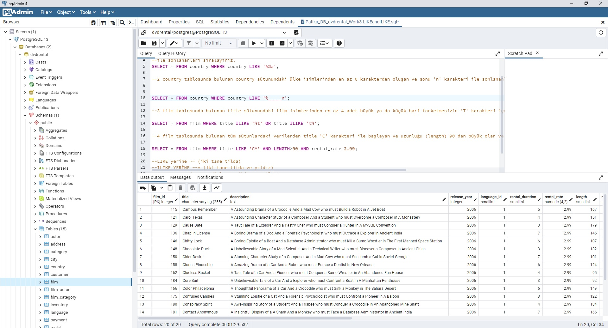

#<h3> PostgreSQL </h3>
What's PostgreSQL? And Queries

---<b>Work 1</b>--<i>WHERE, AND uses</i>-- 
--1 
SELECT title,description FROM film; 
--2 
SELECT title,length FROM film WHERE length>60 AND length<75; 
--3 
SELECT * FROM film WHERE rental_rate=0.99 AND replacement_cost=12.99 OR replacement_cost=28.99; 
--4 
SELECT last_name FROM customer WHERE first_name='Mary'; 
--5 
SELECT * FROM film WHERE NOT length>50 AND rental_rate=2.99 OR rental_rate=4.99; 
 
 

---<b>Work 2</b>--<b><i>BETWEEN, IN uses</i></b>-- 

--1 
SELECT * FROM film WHERE replacement_cost BETWEEN 12.99 AND 16.99; 
--2 
SELECT first_name,last_name FROM actor WHERE first_name IN ('Penelope','Nick','Ed') OR last_name IN ('Penelope','Nick','Ed'); 
--3 
SELECT * FROM film WHERE rental_rate IN (0.99, 2.99, 4.99) AND replacement_cost IN (12.99, 15.99, 28.99); 

---<b>Work 3</b>--<b><i>LIKE, ILIKE uses</i></b>-- 

--1 country tablosunda bulunan country 
--sütunundaki ülke isimlerinden 'A' karakteri 
--ile başlayıp 'a' karakteri 
--ile sonlananları sıralayınız.
SELECT * FROM country WHERE country LIKE 'A%a';

--2 country tablosunda bulunan country sütunundaki ülke isimlerinden en az 6 karakterden oluşan ve sonu 'n' karakteri ile sonlananları sıralayınız.

SELECT * FROM country WHERE country LIKE '%_____n';

--3 film tablosunda bulunan title sütunundaki film isimlerinden en az 4 adet büyük ya da küçük harf farketmesizin 'T' karakteri içeren film isimlerini sıralayınız.

SELECT * FROM film WHERE title ILIKE '%t' OR title ILIKE 't%';

--4 film tablosunda bulunan tüm sütunlardaki verilerden title 'C' karakteri ile başlayan ve uzunluğu (length) 90 dan büyük olan ve rental_rate 2.99 olan verileri sıralayınız.

SELECT * FROM film WHERE title LIKE 'C%' AND LENGTH>90 AND rental_rate=2.99;

 

--LIKE yerine ~~ (iki tane tilda)
--ILIKE YERİNE ~~* (iki tane tilda ve yıldız)
--NOT LIKE yerine !~~ (ünlem ve iki tane tilda)
--ILIKE YERİNE !~~*	 (ünlem, iki tane tilda ve yıldız)  kullanılabilir

---<b>Work 4</b>--<b><i>DISTINCT, COUNT uses</i></b>-- 

 

--1 film tablosunda bulunan replacement_cost sütununda bulunan birbirinden farklı değerleri sıralayınız. 
SELECT DISTINCT replacement_cost FROM film; 
--2 film tablosunda bulunan replacement_cost sütununda birbirinden farklı kaç tane veri vardır? 
SELECT COUNT (DISTINCT  replacement_cost) FROM film; 
--3 film tablosunda bulunan film isimlerinde (title) kaç tanesini T karakteri ile başlar ve aynı zamanda rating 'G' ye eşittir? 
SELECT * FROM film WHERE title LIKE 'T%' AND rating='G'; 
--4 country tablosunda bulunan ülke isimlerinden (country) kaç tanesi 5 karakterden oluşmaktadır? 
SELECT COUNT (country) FROM country WHERE country LIKE '_____'; 
--5 city tablosundaki şehir isimlerinin kaç tanesi 'R' veya r karakteri ile biter? 
SELECT COUNT (city) FROM city WHERE city ILIKE '%r'; 

---<b>Work 5</b>--<b><i>ORDER BY, LIMIT, OFFSET uses</i></b>-- 

 

---<b>Work 6</b>--<h3><i>AGGREGATE FUNCTIONS</i></h3>-- 

 

--1-film tablosunda bulunan rental_rate sütunundaki değerlerin ortalaması nedir? 

SELECT ROUND(AVG(rental_rate),2) FROM film; 

--2-film tablosunda bulunan filmlerden kaç tanesi 'C' karakteri ile başlar? 
SELECT COUNT(title) FROM film WHERE title LIKE 'C%'; 

--3-film tablosunda bulunan filmlerden rental_rate değeri 0.99 a eşit olan en uzun (length) film kaç dakikadır? 

SELECT MAX(length) FROM film WHERE rental_rate IN(0.99); 

--4-film tablosunda bulunan filmlerin uzunluğu 150 dakikadan büyük olanlarına ait kaç farklı replacement_cost değeri vardır? 
SELECT COUNT(DISTINCT(replacement_cost)) FROM film WHERE replacement_cost>150; 

---<b>Work 7</b>--<b><i>GROUP BY, HAVING uses</i></b>-- 

--1-film tablosunda bulunan filmleri rating değerlerine göre gruplayınız. 
SELECT rating, count(*) FROM film GROUP BY rating; 
--2-film tablosunda bulunan filmleri replacement_cost sütununa göre grupladığımızda film sayısı 50 den fazla olan replacement_cost değerini ve karşılık gelen film sayısını sıralayınız. 

SELECT replacement_cost, count(*) FROM film GROUP BY replacement_cost HAVING count(replacement_cost) >50; 
--3-customer tablosunda bulunan store_id değerlerine karşılık gelen müşteri sayılarını nelerdir?  
SELECT store_id , COUNT(*) FROM customer GROUP BY store_id; 
--4. city tablosunda bulunan şehir verilerini country_id sütununa göre gruplandırdıktan sonra en fazla şehir sayısı barındıran country_id bilgisini ve şehir sayısını paylaşınız. 
SELECT  country_id, count(city) from city	Group by country_id	ORDER BY COUNT(city_id) DESC Limit 1 ; 

 

