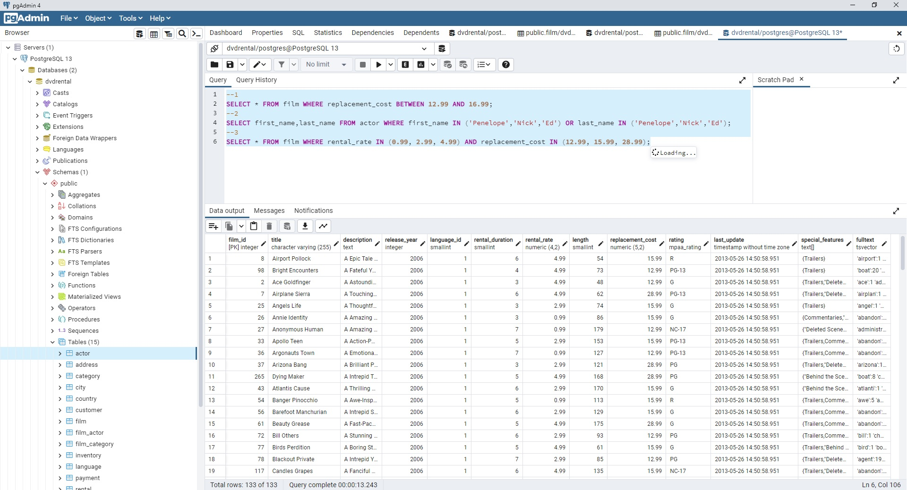

# PostgreSQL
What's PostgreSQL? And Queries

---<b>Work 1</b>--WHERE, AND uses-- 
--1 
SELECT title,description FROM film; 
--2 
SELECT title,length FROM film WHERE length>60 AND length<75; 
--3 
SELECT * FROM film WHERE rental_rate=0.99 AND replacement_cost=12.99 OR replacement_cost=28.99; 
--4 
SELECT last_name FROM customer WHERE first_name='Mary'; 
--5 
SELECT * FROM film WHERE NOT length>50 AND rental_rate=2.99 OR rental_rate=4.99; 
 
 

---<b>Work 2</b>--BETWEEN, IN uses-- 

--1 
SELECT * FROM film WHERE replacement_cost BETWEEN 12.99 AND 16.99; 
--2 
SELECT first_name,last_name FROM actor WHERE first_name IN ('Penelope','Nick','Ed') OR last_name IN ('Penelope','Nick','Ed'); 
--3 
SELECT * FROM film WHERE rental_rate IN (0.99, 2.99, 4.99) AND replacement_cost IN (12.99, 15.99, 28.99); 

